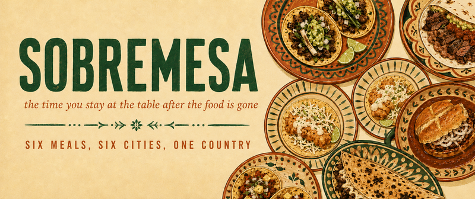

# Sobremesa



**Six meals, six cities, one country.**

*Sobremesa* is the Spanish word for the time you stay at the table after the food is gone, talking. There is no English equivalent.

This is a record of six meals eaten in six Mexican cities over fourteen years, organized around one number: how long I stayed at each table.

**Live:** [add your Vercel URL]
**Write-up:** [add your dev.to post URL]

Submitted to the [DEV Frontend Challenge, Comfort Food Edition](https://dev.to/challenges/frontend-2026-07-29), Perfect Landing prompt.

---

## What it is

A single static page. No framework, no build step, no dependencies, no tracking, no cookies, no storage.

Six entries, each with a dish, a place, a verified fact, a personal note, and a duration. The durations are summed at runtime. At the end, a form lets you enter your own table and download a card of it, generated entirely in your browser.

## Running it

There is nothing to install.

```bash
git clone https://github.com/[you]/sobremesa.git
cd sobremesa
open index.html
```

Or serve it however you like:

```bash
python3 -m http.server 8000
```

## Structure

```
index.html        the entire site: markup, CSS and JS inline
assets/           six dish illustrations plus the paper and ornament textures
design/           Claude Design component source, not deployed
```

`index.html` is self-contained on purpose. One file, one deliverable, nothing to break in a build.

## Accessibility

This was the first design constraint, not a pass at the end. What was actually done:

**Semantics**
- One `h1`, then `h2` per section, then `h3` per entry. No skipped levels.
- `header`, `main`, `footer` landmarks. Entries are a real `<ol>`.
- Every control is a native `button`, `a`, or `input`. No clickable divs.
- Spanish terms carry `lang="es"` so screen readers pronounce them with Spanish phonics rather than mangling them with English ones.

**Keyboard**
- Fully operable by keyboard alone. Buttons respond to Enter and Space.
- Skip link is the first focusable element.
- Focus is never lost or reset to the body after an interaction.
- Every disclosure carries `aria-expanded` reflecting real state and `aria-controls` pointing at the region it opens.

**Colour**
- Every foreground and background pair was computed, not eyeballed. All meet WCAG 2.1 AA: 4.5:1 for body text, 3:1 for large text and non-text UI.
- The paper grain was originally an overlay above the content with `mix-blend-mode: multiply`. It multiplied the text as well as the backgrounds and quietly pushed three pairs below AA. It was rebuilt as a per-surface background layer so it multiplies against the background colour only and never touches a glyph. The texture was regenerated with bounded alpha so the worst-case pixel is computable rather than pure black.
- No information is conveyed by colour alone.

**Motion and reflow**
- `prefers-reduced-motion: reduce` removes motion and removes no content.
- Usable from 320px with no horizontal scroll.
- Touch targets are at least 44px.

**Progressive enhancement**
- Every entry, fact and note is present in the HTML source. JavaScript collapses the panels on load; it does not render the content.
- With JavaScript disabled, the whole page reads.

## Privacy

The "add your table" form runs entirely in your browser. It makes no network request, sets no cookie, and uses no `localStorage` or `sessionStorage`. The card you download is generated as an SVG blob client-side. Nothing you type leaves your machine.

## The illustrations

The six dish illustrations are AI-generated, and the page says so:

> Illustrated from memory. Fourteen years, and I photographed almost none of it.

They are illustrations, not photographs, and they do not pretend otherwise.

## The facts

Every factual claim about a dish was researched and verified. A number of better-sounding claims were cut for being folklore rather than fact, including:

- The Japanese tempura origin of the Baja fish taco. No documented evidence chain, only immigration adjacency.
- That birote salado cannot be baked outside Guadalajara. Repeated everywhere, supported nowhere, disproven by bakers abroad.
- Every accidental-discovery origin story. The torta ahogada dropped in salsa, the quesillo over-curdled by a girl, Caesar Cardini running out of ingredients. Same folk template, three different cities.

Where a claim is contested, the page says so. El Huequito opened in 1959 and El Tizoncito in 1966, both claim tacos al pastor, and neither claim is settled. The page leaves it that way.

## Credits

Type: [Alfa Slab One](https://fonts.google.com/specimen/Alfa+Slab+One), [Crimson Pro](https://fonts.google.com/specimen/Crimson+Pro) and [Oswald](https://fonts.google.com/specimen/Oswald), all SIL Open Font License.

Built with AI assistance throughout: research, code, and the illustrations. Every factual claim was verified against sources and every design decision was made by a human.

**AI assisted. Human approved. Powered by NLP.**

## License

MIT. See [LICENSE](LICENSE).
